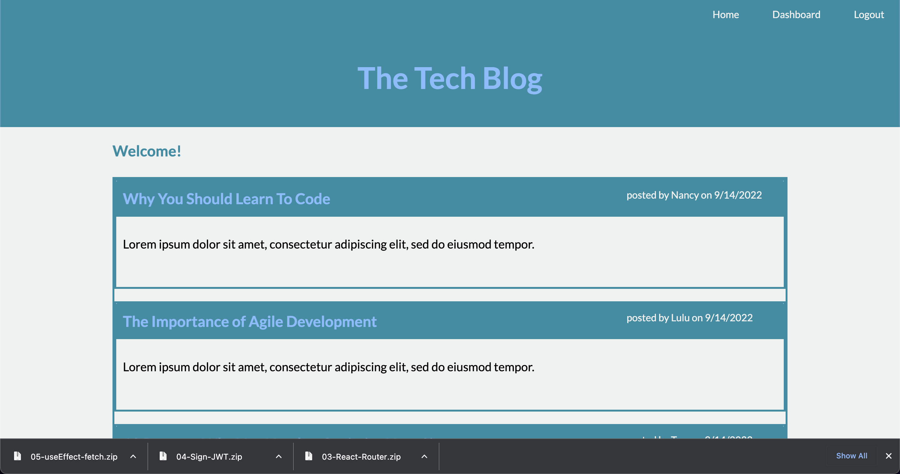

# Tech Blog

## Description
This is a CMS-style blog site similar to a users can publish, edit, comment and delete their blog posts. Users can also create an account, login, logout, and manage their blog posts. This application is for developer and tech lovers who want to read, learn, and educate others about tech.

## Getting Started
The application’s folder structure follows the Model-View-Controller paradigm. You’ll need to use the express-handlebars package to use Handlebars.js for the Views, use the MySQL2 (Links to an external site.) and Sequelize (Links to an external site.) packages to connect to a MySQL database for your Models, and create an Express.js API for your Controllers.

You’ll also need the dotenv package (Links to an external site.) to use environment variables, the bcrypt package (Links to an external site.) to hash passwords, and the express-session (Links to an external site.) and connect-session-sequelize (Links to an external site.) packages to add authentication.
## Screenshot

## Link
Heroku Link: https://tech-blog-trish.herokuapp.com/

Github Link: https://github.com/triciaax/tech-blog/
